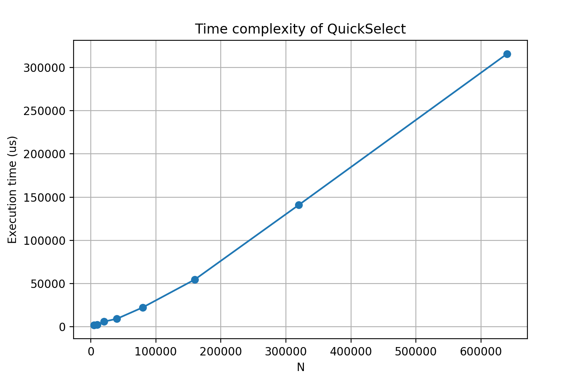

# QuickSelect

[Implementation](#references) [1] and analysis of Quickselect algorithm.

## Algorithm
Quickselect is an algorithm used to find the _k_th smallest elemetn of a list. The straightforward way to achieve this would be to order the list and then return the _k_th element. This would resulst in a complexity of _O(n log n)_. With Quickselect we obtain an average time complexity of _O(n)_, with a worst case of _O(n^2)_

The algorithm is basically the same as Quicksort but instead of keep sorting both sides of the pivot, we check what position the pivot is and we continue working *only* on the side where we know is the number we are looking for.

For example, imagine that after partitioning the pivot ends in the index 4 (starting at 0). We now know that the pivot is the 5th smallest number. If we are looking for the 3rd element, then we'll continue working to the left of the pivot. If we were looking for the 32th element, we would continue to the right.

The general analysis is complicated, but in the best case scneario, where the pivot lands in the middle of the array every time, we see that we will be doing this ammount of work every iteration:

n + n/2 + n/4 + n/8 + n/16...

Which is equal to:

n * (1 + 1/2 + 1/4 + 1/8 +...) = 2n -> O(n)

And we can time our algorithm and see that, in fact, this is the case:

## References
[1] Eppstein, David "Blum-style analysis of Quickselect" https://11011110.github.io/blog/2007/10/09/blum-style-analysis-of.html
